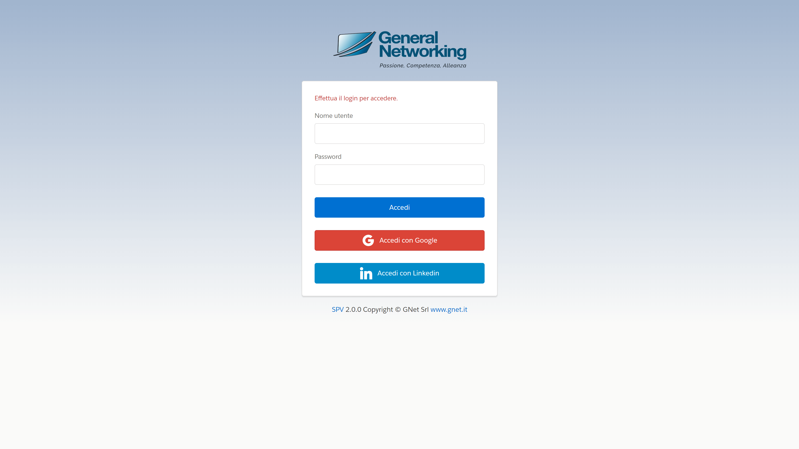
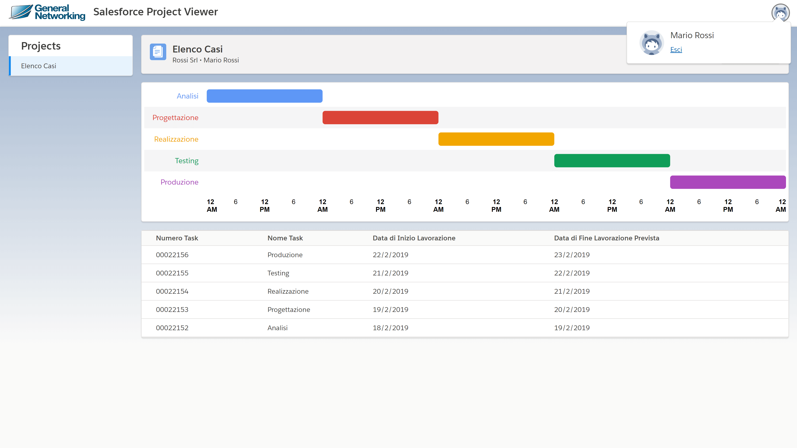
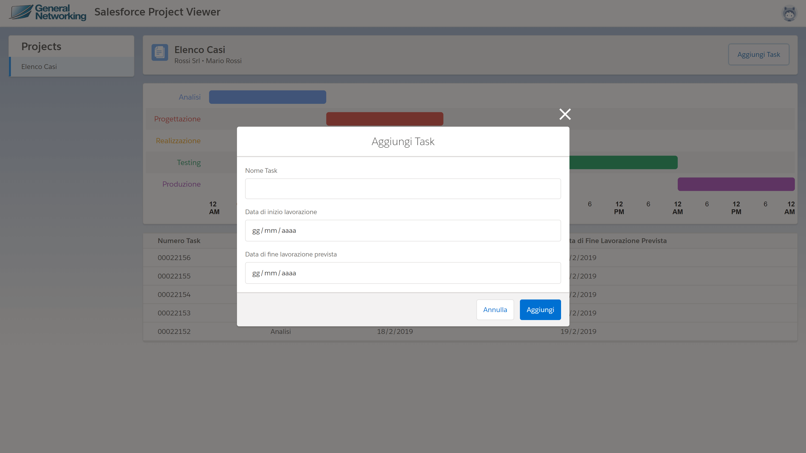

<a href="https://github.com/matteoveronesi/stage2019/blob/master/README.md" style="font-size:16px">Home</a> > <a href="https://github.com/matteoveronesi/stage2019/blob/master/about/README.md" style="font-size:16px">About</a> > User Manual

# User Manual

This Manual explain how to use the Web Client, if You search the server-side documentation, maybe the [Project](PROJECT.md) and [Development](DEVELOPMENT.md) files will help You out.

## Perform the Login

To access the web page You will need Your dedicated Contact's profile credentials. Then insert them in the relative fields. Soon will be implemented the Google & Linkedin login option that is currently disabled.

   

## Viewing a Project

As You log in, You will see the first project in the list (currently there can be only one project). The data is displayed both in the Gantt Chart and in the table.

   

## User Interactions

Clicking the top-right Avatar icon will open a popup that contains the user operations. Currently there's only a log out option. 

   

## Adding a Task 

On the right side of the box where the current Project name is displayed, there's the "Add Task" button which open a modal that will let You add a new Task. If the request ends well, the modal will be closed and the data reloaded.

  
