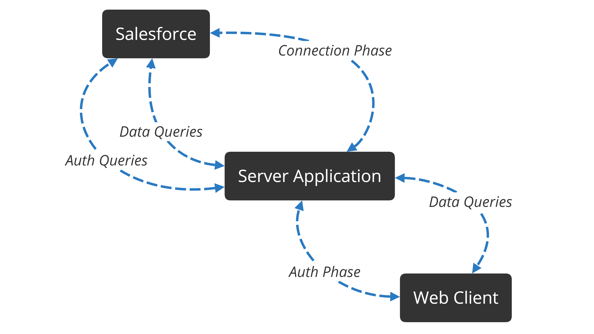

<a href="https://github.com/matteoveronesi/stage2019/blob/master/README.md" style="font-size:16px">Home</a> > <a href="https://github.com/matteoveronesi/stage2019/blob/master/about/README.md" style="font-size:16px">About</a> > Project Behavior

# Project Behavior

Behind the Scenes...

## Purpose

Build a Website that visualize your current Salesforce's projects status. But if You know Salesforce You will also know that there isn't any Project Object in it, in fact, this is an abstract concept, and every "Project" is composed of Tasks that simply are Salesforce Case.

## Components

To achieve this purpose I used these technologies:

- [NodeJs](https://nodejs.org/) - Simple javascript runtime
- [Express](https://expressjs.com/) - Node framework for web apps
- [JSforce](https://jsforce.github.io/) - Salesforce API Library
- [Axios](https://www.npmjs.com/package/axios) - Promise based HTTP client
- [Passport](http://www.passportjs.org/) -  Authentication middleware for NodeJs
- [SLDS](https://lightningdesignsystem.com/) - Salesforce Lightning CSS library
- [Google Charts](https://developers.google.com/chart/) - Intuitive JS library for visualizing data into a Chart 
- [JQuery](https://jquery.com/) - JS library for easily DOM & AJAX management

And those languages:

- HTML5
- CSS3
- Javascript

## System Behavior

- **Connection Phase** The first time you load the app, You will be redirect to Your Salesforce to allow the App to access the database. Next the App will save a token that is used to open a new Salesforce connection without needing a new permission. If the token is already saved, the App will skip this step and open a new connection. Once this phase is completed, the App will open the server on the localhost, port 3000.

- **Auth Phase & Auth Queries** This phase start when someone access the Web Server. The Client send to the App the login data and allow the access if the credentials are correct.

- **Data Queries** These are both retrieving data and adding data. The Client requests the projects data, the App checks the request and pass the request to Salesforce. Same logic for the add process.

 